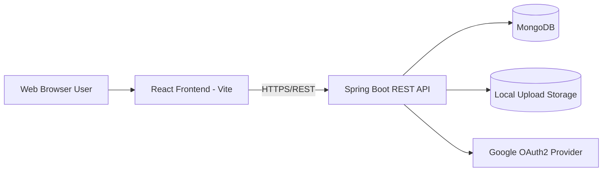
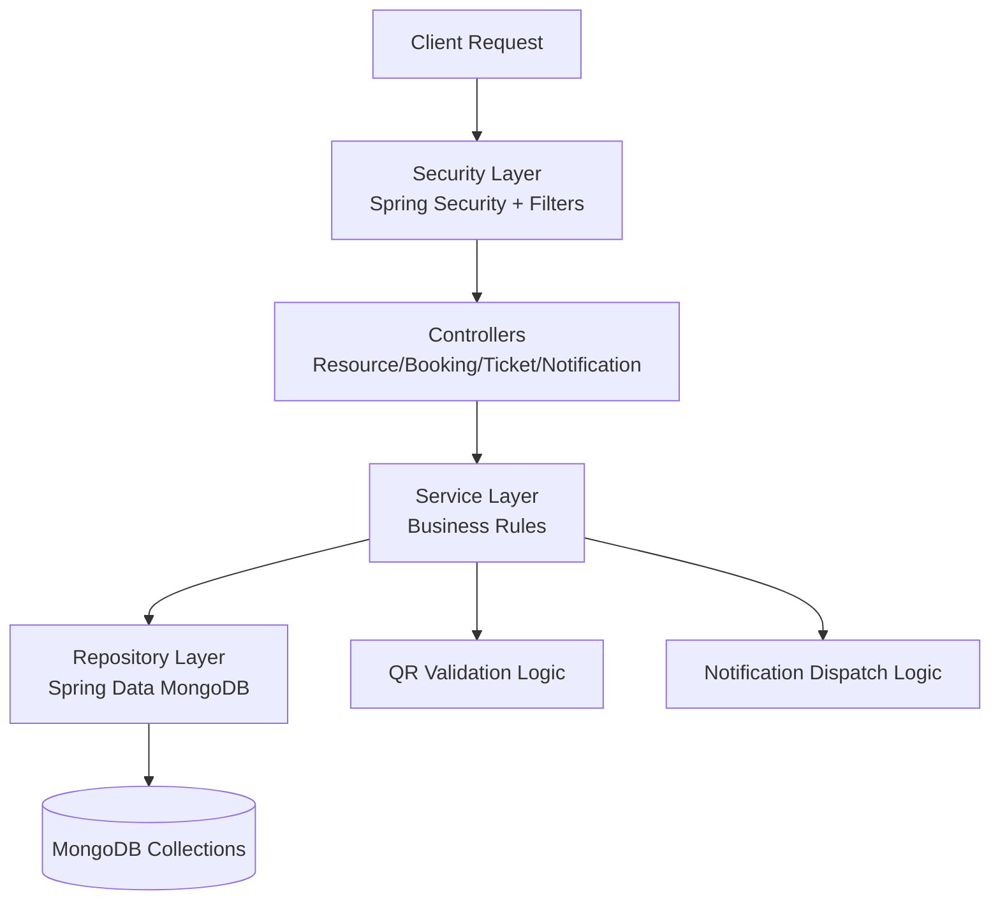
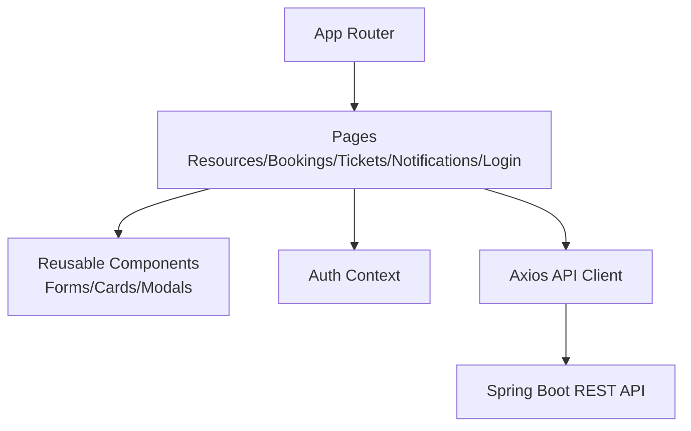

# PAF 2026 Assignment Documentation

This document provides the required non-code assignment evidence.
All content here is documentation-only and does not change runtime behavior.

## 1. Requirements

### 1.1 Functional Requirements - REST API

1. The API shall support CRUD operations for campus resources.
2. The API shall allow authenticated users with USER role to create bookings.
3. The API shall prevent booking time-slot conflicts for the same resource.
4. The API shall allow ADMIN users to approve or reject bookings.
5. The API shall generate and expose QR validation data for approved bookings.
6. The API shall provide a public endpoint to verify QR check-in data.
7. The API shall support maintenance ticket creation and status updates.
8. The API shall support ticket comments and technician assignment.
9. The API shall expose notifications APIs for unread/all notifications and mark-as-read actions.
10. The API shall enforce role-based access control using Spring Security.

### 1.2 Functional Requirements - Client Web Application

1. The web app shall provide role-based login/authorization views.
2. The web app shall allow users to browse, filter, and search resources.
3. The web app shall allow eligible users to create and manage bookings.
4. The web app shall show booking state transitions and rejection reasons.
5. The web app shall render booking QR codes for approved bookings.
6. The web app shall provide a QR verification screen for check-in validation.
7. The web app shall allow users to create and track maintenance tickets.
8. The web app shall provide ticket details, comments, and status visibility.
9. The web app shall provide a notifications UI with unread/all filtering.
10. The web app shall show and hide actions based on user role permissions.

### 1.3 Non-Functional Requirements

1. Security:
   - Enforce authentication and role checks on protected endpoints.
   - Restrict CORS to approved front-end origins.
   - Validate request payloads and return safe error messages.
2. Performance:
   - Target API response under 500 ms for typical list/read operations in local test data conditions.
   - Use pagination/filters where needed to limit payload size.
3. Scalability:
   - Use stateless REST endpoints and MongoDB collections that can scale horizontally.
   - Keep service/controller/repository layers separated for maintainability and growth.
4. Usability:
   - Provide clear status labels, validation messages, and role-aware navigation.
   - Ensure responsive UI behavior across desktop and mobile widths.

## 2. Architecture Design

### 2.1 Overall System Architecture (excluding mobile app)

### 2.2 REST API Architecture

### 2.3 Frontend Architecture

## 3. Implementation Evidence

Backend implementation is in the Spring Boot project with layered structure:
- Controllers: endpoint handling and response mapping.
- Services: business logic and validation rules.
- Repositories: MongoDB data access.
- DTOs: request payload models to decouple API contracts from persistence entities.
- Exception handling: centralized validation exception handling with `@RestControllerAdvice`.
- Security: role-based auth and OAuth/dev flow support.

Frontend implementation is in React with route-based pages and shared components:
- Feature pages for resources, bookings, tickets, notifications, and QR verification.
- Shared auth state and API integration through context and axios client.

## 4. Testing and Quality Evidence

### 4.1 Automated Tests

- Backend test class exists and executes Spring context load validation.
- CI workflow runs backend test command before packaging.

### 4.2 Validation and Error Handling

- Jakarta Bean Validation annotations are used on request models.
- Controllers include structured validation error responses.
- Business-rule checks include conflict detection and invalid state handling.

### 4.3 Manual/API Verification Evidence (to attach in submission)

1. Postman or equivalent API call screenshots for key endpoints.
2. UI screenshots for success and error flows.
3. CI run screenshots showing green checks.

## 5. Version Control and CI

### 5.1 GitHub Repository

- Source is hosted in GitHub repository with commit history and branch workflow.

### 5.2 GitHub Actions Workflow

The repository includes a CI workflow at `.github/workflows/build.yml` with:
1. Backend pipeline: Java setup, Gradle tests, and backend build.
2. Frontend pipeline: Node setup, dependency install, optional lint, and production build.
3. Triggers on push and pull requests for `main` and `dev` branches.

## 6. Assignment Checklist

- Requirements documented (functional + non-functional): Completed.
- Architecture diagrams documented: Completed.
- Implementation delivered (Spring Boot + React): Completed.
- Testing/quality evidence section documented: Completed.
- GitHub + GitHub Actions CI documented: Completed.
